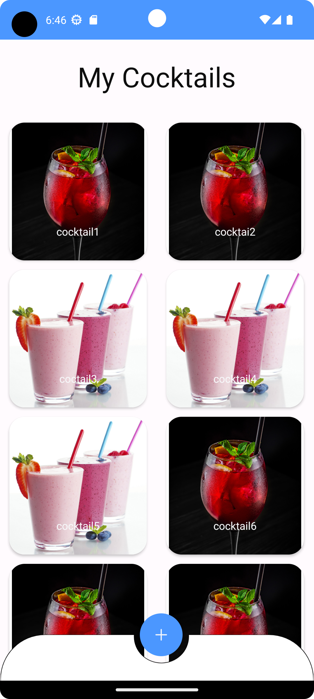
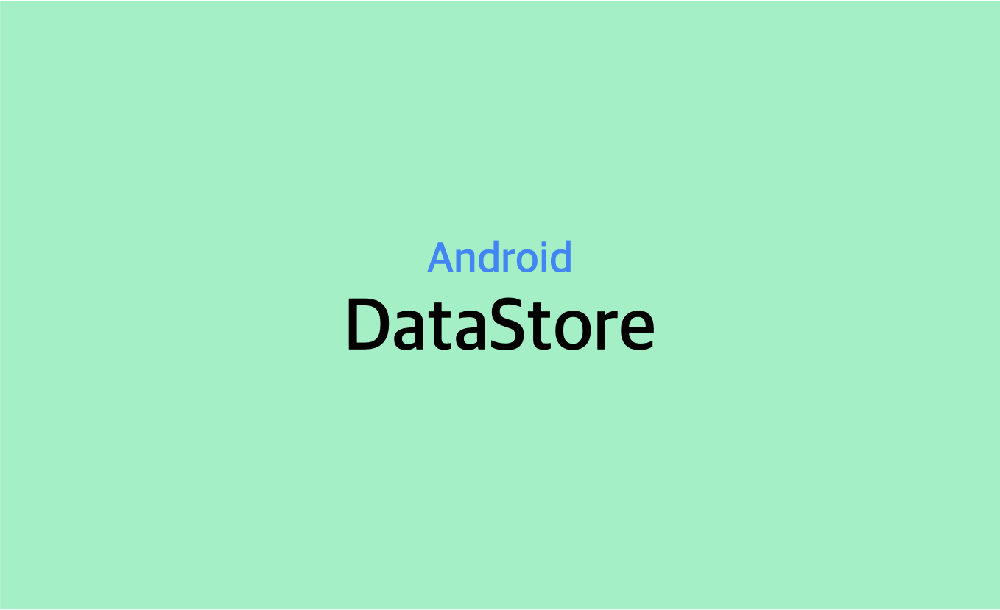
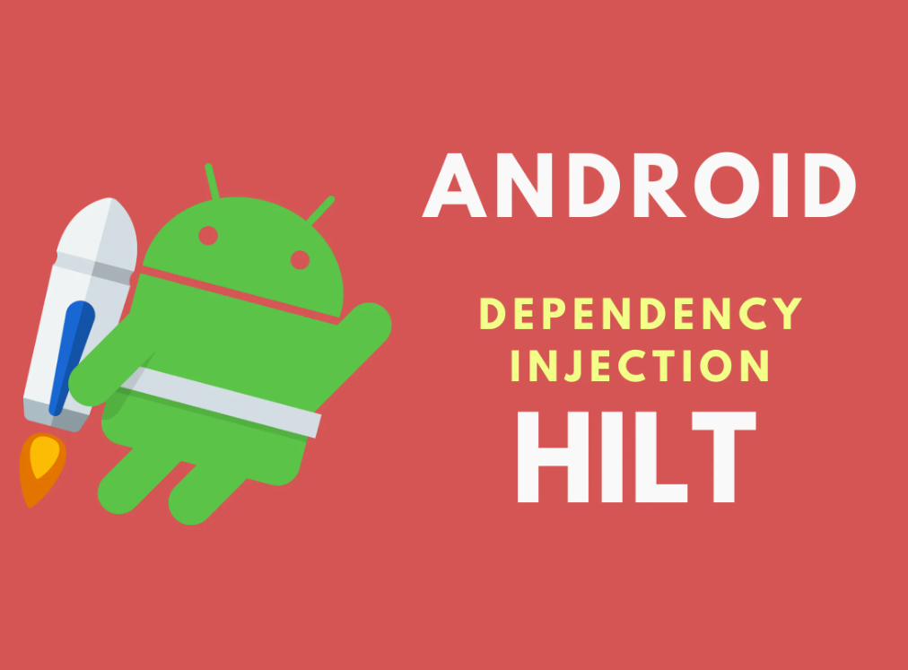
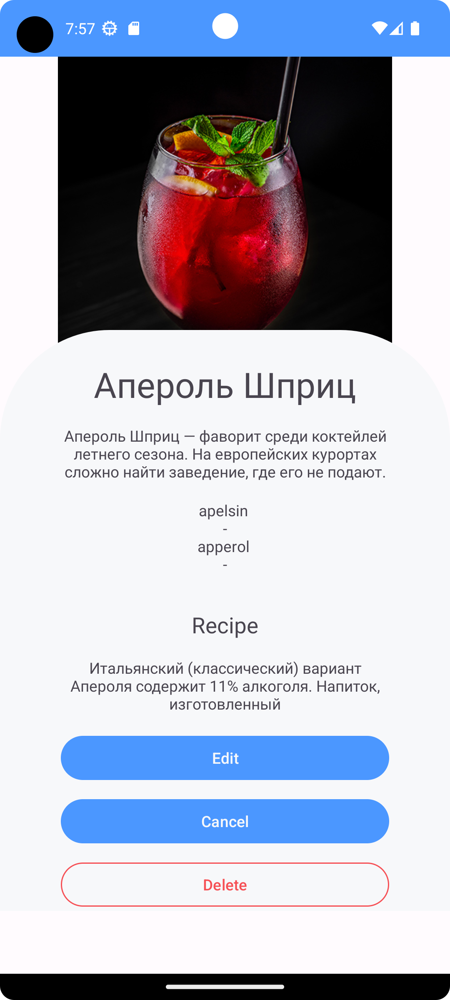
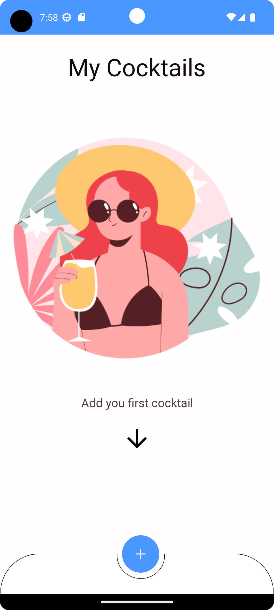

# Приложение для хранения рецептов коктейлей:
Приложение с помощью которого ты можешь записать рецепт коктейля и он будет у тебя под рукой.

<p  align="center">
<code></code>
</p>

## Стек используемых технологий

<p  align="left">
<code></code>
<code></code>
<code></code>
<code></code>
<code></code>
<code></code>
</p>

##  Описание работы приложения

После загрузки приложения мы видим экран где есть:
список коктейлей.
Для перехода к описанию коктейля тапаем на любое изображение коктейля.

На экране карточки коктейля, есть: тайтл, описание, ингредиенты, рецепт, фото коктейля.

<p  align="center">
<code></code>
</p>

Для добавления нового коктейля нужно тапнуть на кнопку с крестиком на главном экране.

<p  align="center">
<code></code>
</p>

На экране добавления карточки коктейля, есть поля: тайтл, описание, ингредиенты, рецепт, возможность добавить фото коктейля.

Если мы хотим сохранить коктейль, то тапаем по кнопке ```SAVE```.

<p  align="center">
<code></code>
</p>

Для работы удаления коктейля из списка нужно перейти в карточку и тапнуть на кнопку ```DELETE```.

<p align="center">
  <code>  </code>
</p>

## Описание проекта

В проекте использовал:

1. Языки Kotlin + XML.
2. Архитектура Clean Architecture + MVVM.
3. Многомодульность - отдельно по слоям Data, Domain, Presentation (По фичам заняло бы больше времени).
4. Навигация с помощью Jetpack's Navigation Component.
5. Инъекция зависимости с помощью Hilt.
6. Хранение данных в Room.
7. Получение данных из ViewModels через StateFlow.